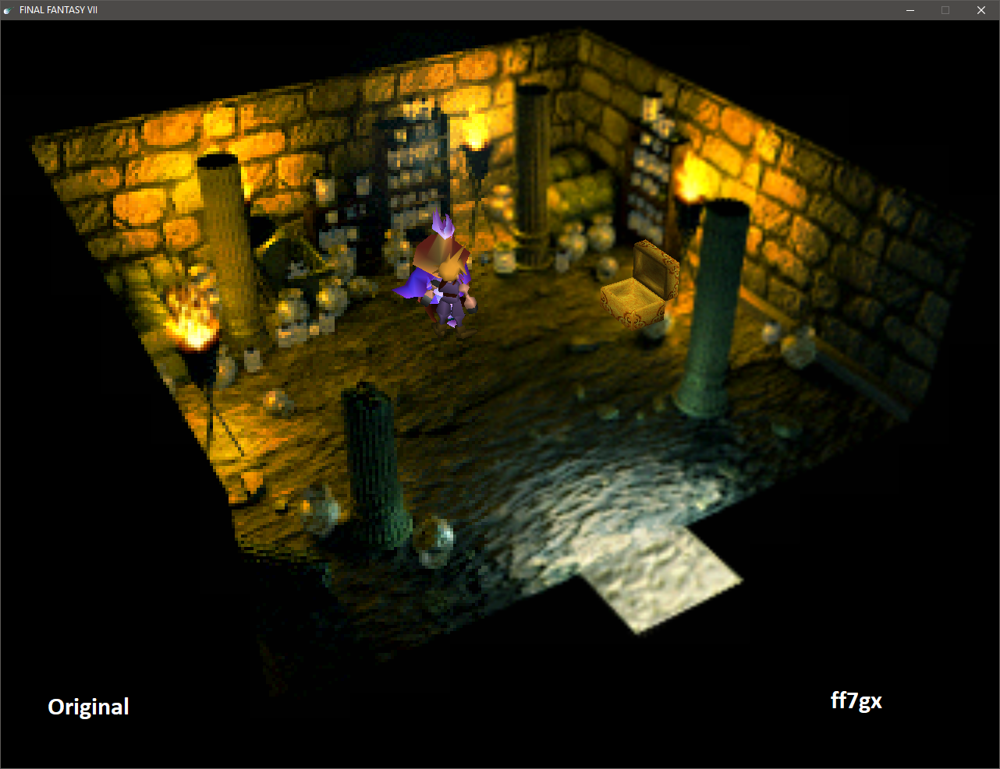

# ff7gx
Final Fantasy VII Graphics Extender

ff7gx is a mod for the Steam version of Final Fantasy VII to slightly improve its horribly outdated look. The mod is currently
a bunch of glitchy hacks and exploratory coding, so the game will be mostly unplayable.



## Building
### Prerequisites
* Python 2.7 (`python.exe` must be in `PATH`)
    * Alternatively, you can disable the custom build step in the project settings and run `wrappergen.py` in the `ff7gx/` directory.
* Visual Studio 2017 with C++ support

The build is tested only on Visual Studio 2017 Community. The build should work out of the box by opening `ff7gx.sln` and
building the `Debug (x86)` configuration.

## Running
1. Build the project.
2. In the FFVII installation directory (usually `<SteamLibrary>/steamapps/common/FINAL FANTASY VII`), rename `AF3DN.P`
to `AF3DN2.P`.
3. Copy `AF3DN.P` from the build directory to the FFVII directory.
    * Another option is to add the build directory to `PATH` and restarting Steam before running the game (good for development).
4. Run the game.

## Configuration
The mod reads configuration from `ff7gx.ini` in the game directory, with the following format and default values:
```
[ff7gx]
LoadFrida=0
FridaPath="frida-gadget.dll"
LoadApitrace=0
ApitracePath="apitrace-d3d9.dll"
WaitForDebugger=0
```
* `LoadFrida`: if `1`, loads the DLL specified in `FridaPath` during initialization. Useful for instrumentation with Frida
(check `apitrace.js` for an example).
* `LoadApitrace`: if `1`, loads the DLL specified in `ApitracePath` during initialization. Used for debugging D3D stuff.
* `WaitForDebugger`: if `1`, blocks game initialization until a debugger is attached.
